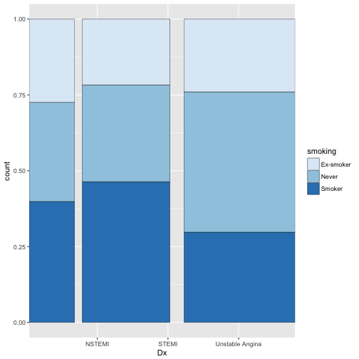
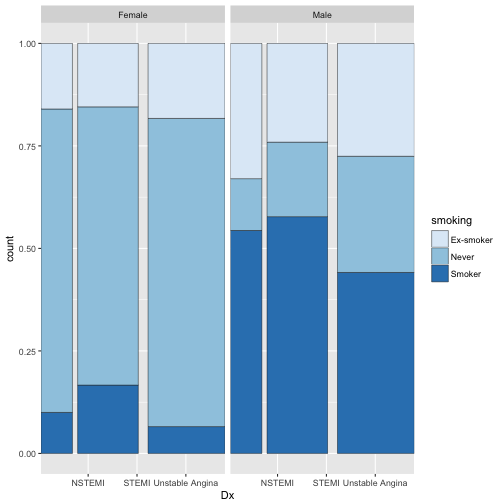
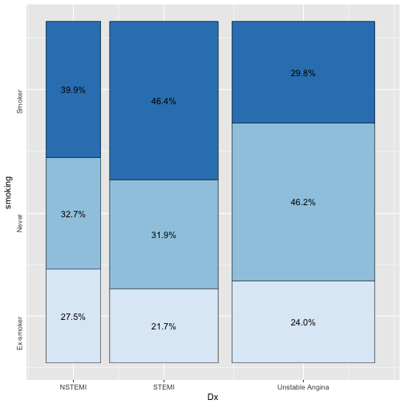

## New geom : geom_spine()

spineplot()과 같은 기능을 하는 새로운 geom()을 만들기 위해 다음과 같은 코드를 작성했습니다.


```r
require(ggplot2)

"%||%" <- function(a, b) {
     if (!is.null(a)) a else b
}

geom_spine <- function(mapping = NULL, data = NULL,
                       stat = "count", position = "fill",
                       color="black",size=0.2,
                       ...,
                       width = NULL,
                       binwidth = NULL,
                       na.rm = FALSE,
                       show.legend = NA,
                       inherit.aes = TRUE) {
     
     layer(
          data = data,
          mapping = mapping,
          stat = stat,
          geom = GeomSpine,
          position = position,
          show.legend = show.legend,
          inherit.aes = inherit.aes,
          params = list(
               width = width,
               na.rm = na.rm,
               color=color,
               size=size,
               ...
          )
     )
    
}

colcount=function(data){
     result=c() 
     myx=unique(data$x)
     for(i in 1:length(myx)) result=c(result,sum(data[data$x==myx[i],"count"]))
     result                                     
}

GeomSpine <- ggproto("GeomSpine", GeomRect,
                     required_aes = c("x", "y"),
                     
                     setup_data = function(data, params) {
                         
                          data$width <- data$width %||%
                               params$width %||% (resolution(data$x, FALSE) * 0.9)
                          
                          sumc<-c(0,colcount(data))
                          sumc<-cumsum(sumc)
                          total<-sum(data$y)/(length(unique(data$x))+1)
                         
                          data1<-transform(data,
                                           ymin = pmin(y, 0), ymax = pmax(y, 0),
                                           xmin=sumc[x]+(sumc[x+1]-sumc[x])*(1-width)/2,xmax=sumc[x+1]-sumc[x+1]*(1-width)/2)
                          data<-transform(data1,
                                           xmin=xmin/total,xmax=xmax/total,          
                                           x=(xmin+xmax)/(2*total), width=xmax-xmin
                          )
                          data
                          
                     },
                     
                     draw_panel = function(self, data, panel_scales, coord, width = NULL) {
                          
                          ggproto_parent(GeomRect,self)$draw_panel(data, panel_scales, coord)
                     }
)
```


이 코드로 다음과 같은 plot을 그릴 수 있습니다.


```r
require(moonBook)
ggplot(data=acs,aes(x=Dx,fill=smoking))+geom_spine()+
     scale_fill_brewer(palette="Blues")
```



또한 facet_grid()등과도 사용할 수 있습니다.

```r
ggplot(data=acs,aes(x=Dx,fill=smoking))+geom_spine()+
     facet_grid(~sex)+
      scale_fill_brewer(palette="Blues")
```



하지만 x 축의 라벨이 bar에 중앙에 위치하지 않아 이를 고쳐보려고 하는데 잘 안되는군요. 그래서 집단지성의 힘을 빌려보고자 합니다.^^

참고로 제가 만든 ggiraphExtra패키지의 ggSpine()함수는 facet이 안되는 것을 제외하고는 잘 작동합니다.


```r
library(ggiraphExtra)
library(ggiraph)
ggSpine(acs,aes(x=Dx,fill=smoking),addlabel=TRUE)
```




