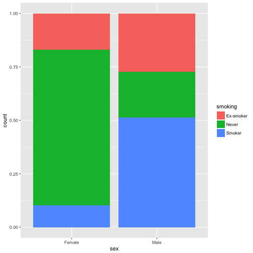

## 막대그래프

오늘도 ggplot문제 하나 드리겠습니다. 
ggplot의 geom_bar()는 stacked bar plot을 만드는데 쓰입니다. 예를 들어 moonBook 패키지의 acs데이타를 사용하여 남여 성별과 흡연 상태에 따른 bar plot을 만들면  다음과 같은 그래프를 만들 수 있습니다.


```r
require(ggplot2)
require(moonBook)

ggplot(data=acs,aes(x=sex,fill=smoking)) +geom_bar() 
```


하지만 position="fill"로 하시면 proportional stacked bar plot을 만들수 있습니다.

```r
ggplot(data=acs,aes(x=sex,fill=smoking)) +geom_bar(position="fill") 
```



이 그래프는 상당히 정보를 왜곡하고 있습니다. 즉 남여의 숫자가 다른데 막대그래프의 폭이 같기 때문에 보기에 따라 남여 전체 숫자가 같게 느껴집니다. R에 기본으로 포함되어 있는 mosaicplot은 이와 같은 왜곡을 해결해줍니다. 


```r
mosaicplot(sex~smoking,data=acs)
```


또한 spineplot() 함수는 spineplot을 그려줍니다.


```r
spineplot(factor(smoking)~factor(sex),data=acs)
```


## 문제 1) ggplot을 이용한 spineplot

spineplot의 개념을 ggplot에 도입하면 다음과 같은 그림을 그릴 수 있습니다. 그리고 columnwise ratio를 라벨로 붙여준다면 더욱 좋겠습니다.


 
또한 geom_bar()와 같이 position="dodge"나 "stack"도 그릴 수 있으면 좋겠습니다.


## spinogram : histogram의 확장

spineplot()함수를 연속형변수에 적용하면 spinogram이 됩니다. 


```r
spineplot(factor(sex)~age,data=acs)
```


## 문제 2) ggplot을 이용한 spinogram

이 spinogram을 ggplot으로 그려보면 다음과 같이 됩니다.


또한 geom_bar()와 같이 position="dodge"나 "stack"도 그릴 수 있으면 좋겠습니다.


이와 같은 일을 할 수 있는 함수를 제작해보셔요. 즉 R 에 기본적으로 포함되어 있는 spineplot()의 ggplot버젼입니다. 

